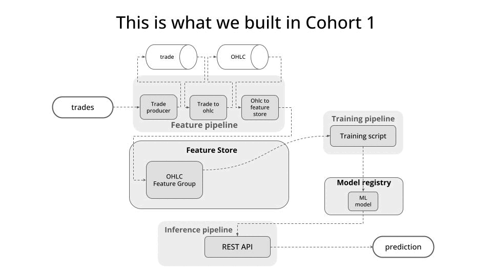

## Welcome to Cohort 2 of Building a Real-Time ML System Together

### In a nutshell

In this second iteration of the course I want to cover more ground. I want us to build a better
ML system for the crypto price prediction problem.

As the duration of the course will be the same as in cohort 1 (which means 4 or 5 weeks) I will re-use
a existing code from the first cohort. Which means that I won't be typing it from beginning to end, but copying fragments of code and walking you through their WHY? and HOW?

    

## Session 1 todos

- [x] Redpanda up and running
- [x] Push some fake data to Redpanda
- [x] Push real-time (real data) from Kraken websocket API
- [x] Extract config parameters
- [x] Dockerize it